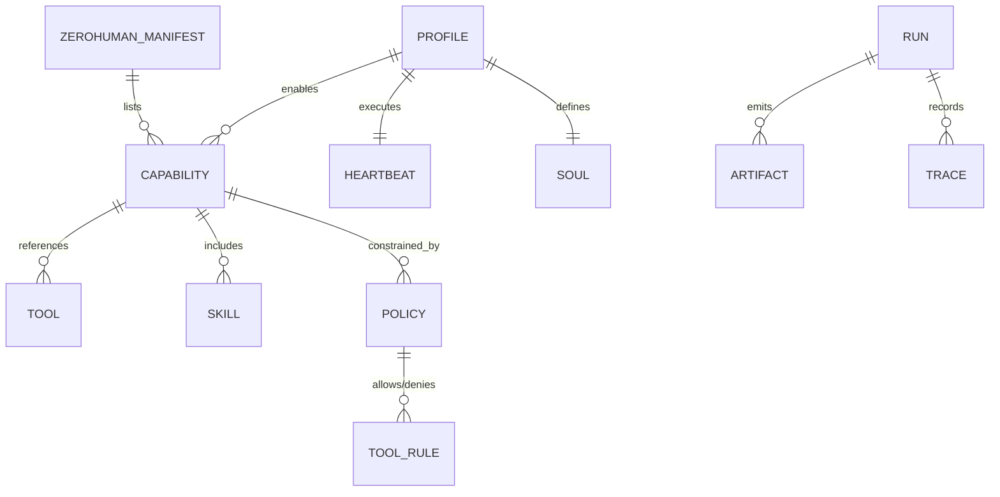
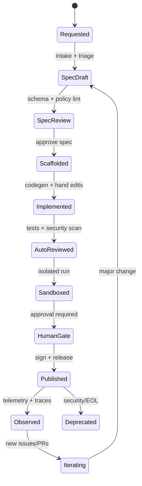

# ZeroHuman: An Open Protocol and Implementation Pattern for Structured AI Operations

## Executive summary

This research briefing proposes **ZeroHuman** as an **open protocol** (file formats + resolution rules) and an **implementation pattern** (catalogue, factory, runtime, middleware, governance) for running structured AI operations at scale: reproducible “skills” (procedural instructions), audited “tools” (typed application integrations), composable “capabilities” (curated tool+skill bundles), and deterministic “agent profiles” (role configuration, heartbeat routines, and identity constraints). The design is grounded in four converging ecosystems: repository-level instruction standards (notably AGENTS.md), the open agent skill format and skill marketplaces (notably skills.sh), orchestration systems that treat agents as organisational units (notably Paperclip), and modern agent runtimes and tooling (standard agent runtimes, plus modern tooling SDKs). The central technical challenge you raised—coordinating **automatic tool creation**, **automatic review**, **manual steering**, and **automatic iteration with artefacts**—is best addressed by separating responsibilities into (a) a **Capability Factory** with an explicit lifecycle and gates, (b) a **Catalogue/Indexer** that validates and moderates published packages, and (c) a **Runtime** that assembles a profile at execution-time using precedence rules, policies, and progressive disclosure. This mirrors how skills ecosystems reduce context bloat (metadata first, instructions only when triggered) and how agent work can be made auditable via ticketing, tracing, and rollback controls. In practice, ZeroHuman should treat **tools as typed, permissioned surfaces** (e.g., the target runtime function tools with JSON Schema and approval gates; hosted container tools with network policies), while treating **skills as workflow playbooks** (SKILL.md) that are versioned, tested, and security-scanned like software. The protocol then gives you a way to: (1) express “what exists” (catalogue manifests), (2) express “what is allowed” (policy manifests), (3) express “how to work” (skills + heartbeat routines), and (4) record “what actually happened” (artefacts + traces). Primary sources used and prioritised are: AGENTS.md and Codex guidance on instruction layering; skills.sh documentation and audits; the Paperclip repository’s orchestration primitives (heartbeats, budgets, governance); agent builder SDK repository/docs for programmatic agent execution and tool controls; and the target runtime docs for tools, approvals, guardrails, tracing, and evaluation. ## Terminology And Roles

As this protocol is agnostic of specific suppliers, these generic terms are used throughout:
- **Agent Builder (or Builder SDK):** The development-time environment and scaffolding framework used to generate, test, and package skills and tools.
- **Target Runtime (or Agent Runtime):** The production environment that executes the run loop, manages state, enforces policies, and invokes tools.
- **Agent CLI:** A command-line interface provided by an agent framework to interact with the agent locally.
- **Capability Factory:** The end-to-end pipeline (CI/CD) where capabilities are drafted, reviewed, tested, and published.

## Research basis and design principles

A credible ZeroHuman protocol must align with existing de facto standards rather than inventing everything from scratch. Three findings are especially “load-bearing”.

First, **instruction layering is already standard practice**. AGENTS.md explicitly endorses nested, close-to-code instructions: agents “read the nearest file in the directory tree” and “the closest one takes precedence”, with user prompts overriding everything. Early agent frameworks formalises this into an instruction chain, with global and project scopes, override filenames, concatenation order, and a bounded prompt size (e.g., max bytes), which is directly reusable as a precedent for ZeroHuman precedence rules. Second, **skills ecosystems solve context bloat via progressive disclosure**. Multiple sources converge on a shared format: a skill is a directory containing a `SKILL.md` with YAML frontmatter (`name`, `description`) and markdown procedures; the agent first loads metadata and only loads full instructions when the skill is activated. This implies ZeroHuman should not put everything into one monolithic “org repo prompt”; it should create a routing layer where descriptions act as “activation rules” and full procedures are loaded on demand. Third, **orchestration systems become robust when they treat agent work as governable operations**. Paperclip positions orchestration as “org charts, budgets, governance, goal alignment, and agent coordination”, with scheduled heartbeats, monthly budgets, immutable audit logs, and rollbackable config changes. This is a blueprint for what ZeroHuman middleware and runtime must provide even if your agents run in different engines.

From these, ZeroHuman should adopt six design principles:

1) **Progressive disclosure by default**: load metadata early; load full content only when needed (skills, tools, references). 2) **Typed tool surfaces + explicit approvals**: tools should carry schemas and be gateable at runtime (per-call approvals, network restrictions, and tool guardrails). 3) **“Most restrictive wins” for permissions**: allow text overrides, but do not allow policy overrides to broaden permissions at lower scopes; this is essential for safety in an ecosystem that installs third-party skills. 4) **Everything is testable**: treat skills like prompts that must be continuously evaluated with captured traces and artefacts, not “vibes”. 5) **Every run is auditable**: traces + artefacts + usage accounting should be first-class; opt-outs (e.g., ZDR limitations) must be explicit. 6) **Governance is part of the protocol**: publishing, moderation, trust tiers, and rollback are not “community extras”; they are necessary to prevent supply-chain compromise in skill ecosystems. ## Canonical object model and schemas

### Definitions and the minimal canonical file set

ZeroHuman’s protocol layer should define a small set of objects that map cleanly to established standards:

- **Skill**: reusable procedural knowledge in `SKILL.md` (YAML frontmatter + Markdown). - **Tool**: typed integration surface (API/CLI/browser/etc.) with schema + auth + permissions and runtime gating; aligns with Agents SDK function tools and approval patterns. - **Capability**: versioned composition of tools + skills + policies + tests, intended to create an operational specialist (e.g., “AcmeCRM Specialist”).  
- **Profile**: role configuration (model/runtime, budgets, concurrency, memory, and which capabilities are enabled). This corresponds to “agents have jobs” rather than chat tabs. - **Heartbeat**: the run-loop checklist that keeps an agent from “blank slate drift” and ensures consistent routines; strongly supported by Paperclip’s “heartbeats” concept. - **Soul**: identity + values + boundaries that should change rarely; this aligns with the security reality that identity/memory files are part of the execution layer and are targeted by attacks. - **Policy**: the enforceable rules (permissions, approval requirements, network policy, data sensitivity, logging, retention). Tool guardrails and policy boundaries should map onto Agents SDK guardrails and approval mechanisms. - **Artefact**: immutable record of what was produced (docs, code patches, configs, exports) and how; Standard evaluation guidance explicitly treats captured runs as “trace + artefacts”. - **zerohuman.yaml**: the root manifest for repository packaging and indexing.

A practical way to keep the protocol implementable is to express these manifests as **YAML**, with embedded **JSON Schema 2020-12** to define tool I/O and artefact shapes (because JSON Schema is widely supported and explicitly designed for describing/validating JSON documents). ### Canonical schema sketches

Below are compact canonical examples. Full end-to-end files are in the appendix section.

```yaml
# zerohuman.yaml
protocol: zerohuman
protocol_version: 0.1.0
kind: capability_package
name: acmecrm-specialist
version: 1.2.0
summary: Specialist capability package for AcmeCRM operations.
license: Apache-2.0
repository:
  forge: github
  org: example-org
  repo: zerohuman-acmecrm-specialist
entrypoints:
  capabilities:
    - capabilities/acmecrm-specialist/capability.yaml
trust:
  publisher: verified
  signatures:
    required: true
indexing:
  discoverable: true
  tags: [marketing-ops, crm, email, crm]
```

This mirrors how skills are “just git repos” that become discoverable through installation and indexing; skills.sh documents that the leaderboard is powered by the open-source CLI and that ranking comes from anonymous aggregated telemetry. ```yaml
# tools/acmecrm/tool.yaml
kind: tool
name: acmecrm_api
version: 0.4.0
description: Typed REST API integration for a AcmeCRM instance.
transport: http
auth:
  scheme: oauth2
  token_source: secret_store
  scopes: [contacts:read, contacts:write, campaigns:read]
permissions:
  network:
    allowed_domains: ["acmecrm.example.com"]
  data:
    default_classification: pii
approval:
  required: true
interface:
  # JSON Schema for tool calls
  input_schema:
    $schema: https://json-schema.org/draft/2020-12/schema
    type: object
    properties:
      operation:
        type: string
        enum: [get_contact, upsert_contact, list_segments, create_campaign_export]
      payload:
        type: object
    required: [operation, payload]
  output_schema:
    $schema: https://json-schema.org/draft/2020-12/schema
    type: object
    properties:
      ok: { type: boolean }
      result: { type: object }
      error: { type: string }
    required: [ok]
```

This is intentionally compatible with “function tools” patterns: the target runtime describes function tools as wrapping local functions with a schema, and also provides approval gates and network policy controls in its tool execution options (notably for shell/container environments). ```yaml
# capabilities/acmecrm-specialist/capability.yaml
kind: capability
name: acmecrm_specialist
version: 1.2.0
description: Execute segmented marketing ops in AcmeCRM with policy-compliant tooling.
tools:
  - ref: tools/acmecrm/tool.yaml
skills:
  - ref: skills/acmecrm-segmentation/SKILL.md
  - ref: skills/acmecrm-campaign-export/SKILL.md
policies:
  - ref: policies/pii-and-outbound.policy.yaml
evals:
  suite: evals/acmecrm-specialist/
  required: [golden_happy_path, auth_failure_path, rate_limit_recovery]
artefacts:
  emits:
    - type: acmecrm_export_zip
    - type: segment_definition
    - type: campaign_audit_note
```

```yaml
# profiles/acmecrm-specialist/profile.yaml
kind: profile
name: acmecrm_specialist_agent
role: marketing_ops_specialist
runtime:
  engine: target_agent_runtime
  language: python
model:
  default: gpt-5.4
budgets:
  per_run_tokens_max: 120000
  monthly_usd_max: 200
concurrency:
  max_active_tasks: 2
capabilities:
  - ref: capabilities/acmecrm-specialist/capability.yaml
identity:
  soul: profiles/acmecrm-specialist/SOUL.md
operation:
  heartbeat: profiles/acmecrm-specialist/HEARTBEAT.md
memory:
  strategy: session
  store: sqlite
```

The “profile + heartbeat” combination is directly motivated by Paperclip’s model: agents wake on schedules, check work, enforce budgets, and operate within governance. The “session memory” choice aligns with the target runtime’s explicit support for sessions as a persistent memory layer. ```yaml
# policies/pii-and-outbound.policy.yaml
kind: policy
name: pii_and_outbound_controls
version: 0.3.0
data_sensitivity:
  classifications:
    pii:
      redaction: required
      retention_days: 30
tool_controls:
  default_needs_approval: true
  allow:
    - tool: acmecrm_api
      operations: [get_contact, upsert_contact, list_segments]
  deny:
    - tool: acmecrm_api
      operations: [create_campaign_export]
      unless:
        human_gate: true
network_policy:
  deny_by_default: true
  allow_domains: ["acmecrm.example.com"]
observability:
  tracing: enabled
  log_tool_io: redacted
```

This is the policy surface that should map to runtime guardrails, tool approvals, and network restrictions. The target runtime has explicit boundary semantics for input/output guardrails and tool guardrails, and emphasises that guardrails do not run uniformly across an entire workflow unless you attach tool guardrails. ```json
// artefacts/artifact.json
{
  "kind": "artifact",
  "artifact_id": "artifact_01HZY...",
  "type": "campaign_audit_note",
  "created_at": "2026-03-28T10:04:12Z",
  "trace": { "trace_id": "trace_...", "workflow": "crm_ops" },
  "inputs": { "task_id": "task_123", "profile": "acmecrm_specialist_agent" },
  "outputs": {
    "summary": "Updated segment rules and verified membership counts.",
    "links": [{ "rel": "crm-segment", "href": "crm://segments/42" }]
  },
  "checks": {
    "policy": "pii_and_outbound_controls@0.3.0",
    "approvals": [{ "tool": "acmecrm_api", "approved_by": "human", "at": "2026-03-28T10:02:01Z" }]
  }
}
```

This artefact model intentionally correlates with tracing: the target runtime tracing records generations, tool calls, handoffs, and guardrails; this is the backbone for auditability and for evals that score both outcomes and process compliance. ### Entity relationship diagram



## Resolution semantics, versioning, and compatibility

### Precedence and resolution rules

ZeroHuman needs deterministic, explainable resolution rules. The most defensible choice is to **mirror AGENTS.md-style layering** for instruction text and **enforce “most restrictive wins”** for security and permissions.

Instruction precedence can be modelled on two precedents:

- AGENTS.md: closest file wins; user prompts override everything. - Codex: instruction chain is built from global + project scopes, concatenated root-to-leaf, with files closer to the working directory appearing later and overriding earlier guidance. A canonical ZeroHuman precedence stack (highest wins) should be:

1. **Explicit user/task input** (task payload + human steering notes)  
2. **Task-local overrides** (task folder overlays, e.g., `tasks/<id>/AGENTS.override.md`-style)  
3. **Profile overlays** (profile-specific heartbeat + soul + profile policy)  
4. **Capability package content** (capability.yaml → skills/tools/policies)  
5. **Organisation global policy and baseline instructions** (org-level AGENTS.md)  
6. **Runtime defaults** (engine defaults, safe baselines)

For *skills*, progressive disclosure should be mandatory: only load metadata initially and load full SKILL.md body only when the agent activates the skill. This is consistent across Early agent skill implementations, Vercel’s skill guidance, and Anthropic’s skills design. For *tools*, the resolution should include a token-safety mechanism: when tool surfaces are large, use namespaces and deferred loading. the target runtime explicitly supports tool search, deferred tool loading, and tool namespaces to reduce tool-schema tokens. ### Versioning and compatibility

Protocol objects should use **Semantic Versioning** (MAJOR.MINOR.PATCH) for all published packages, and the protocol should declare a compatibility contract per object type. SemVer’s core claim is that version numbers communicate compatibility expectations, which is exactly what a multi-repo capability ecosystem needs. Recommended compatibility rules:

- `protocol_version` in `zerohuman.yaml` is SemVer.  
- Each capability/tool/skill declares:
  - `version` (SemVer)
  - `requires.protocol: ">=0.1.0 <0.2.0"`
  - `requires.runtime.engine: target_agent_runtime`
  - `requires.runtime.min_version` (if needed)
- Resolution algorithm:
  - Prefer **pinned versions** (exact).
  - Else select the **highest compatible** version within ranges.
  - Apply a “security patch preference”: if a higher PATCH is available with compatible constraints, prefer it, but require CI re-validation.

### Compatibility with runtimes and ecosystems

ZeroHuman should treat “execution engines” as pluggable, and record which engine executed a run. Two engines are especially relevant in the sources:

- GitHub agent builder SDK exposes the agent CLI runtime programmatically and supports sessions, tool execution, and full lifecycle control, but is explicitly described as technical preview and may change. - the target runtime provides small primitives (agents, tools/handoffs, guardrails) plus tracing and evaluation support, with explicit mechanisms for approvals, sessions, and tool policies. This implies your protocol should be stable even if engines evolve: keep the protocol minimal and push engine-specific settings into adapters.

## Capability factory lifecycle and CI/CD pipeline

### Factory lifecycle with explicit gating

The “automatic tool creation + review + manual steering + automated iteration” problem is a lifecycle design problem. The lifecycle must be explicit, stateful, and observable.

A ZeroHuman **Capability Factory** should implement this canonical state machine:



This structure mirrors two hard lessons from the skills ecosystem:

- Skills are effectively executable workflows with access to sensitive environments; therefore they must be scanned, pinned, and tested like code. - Evals and regression testing are the only reliable way to measure skill improvements and prevent behavioural drift; Standard guidance formalises evals as “prompt → captured run (trace + artefacts) → checks → score”. ### Required artefacts at each lifecycle stage

| Factory stage | Required artefacts | Automated checks | Human gate |
|---|---|---|---|
| Requested | `request.md`, initial `risk.md` | schema skeleton validation | optional |
| SpecDraft | `tool.yaml`, `capability.yaml`, `policy.yaml`, draft skills | lint (YAML/JSON), policy completeness | required for high-risk tools |
| SpecReview | frozen spec + interface schemas | interface contract tests | required |
| Scaffolded | repo layout + stubs + `zerohuman.yaml` | build passes | optional |
| Implemented | code + tests + docs | unit tests; static analysis; secret scans | optional |
| AutoReviewed | eval suite + golden outputs | eval run; failure-path tests; security scan | optional |
| Sandboxed | sandbox run artefacts + trace | policy enforcement + runtime checks | required if outbound/PII |
| HumanGate | approval record | cryptographic signing | required |
| Published | release notes, SBOM/attestations | indexer validation | optional |
| Observed | telemetry + incident reports | anomaly detection | optional |
| Iterating | new PRs + updated versions | regression evals | per-change |

“Security scan” is not optional in 2026: skills registries are under active attack, and OWASP’s Agentic Skills Top 10 explicitly calls for version pinning, scanning, approvals, isolation, and audit logging as baseline controls. ### CI/CD and code generation pipeline

Your requested pipeline—**agent builder SDK → package manifest → the target runtime**—is coherent if you treat the agent builder as a *code-producing worker* inside the factory, and treat the the target runtime as the *execution runtime* for published capabilities.

The agent builder SDK is explicitly positioned as “the same engine behind agent CLI”, handling planning, tool invocation, and file edits. It also exposes strong operational controls: default tooling is effectively “allow-all” unless you restrict tools, and it supports multiple authentication approaches including BYOK. These properties make it suitable as a factory worker, but they also demand strong sandboxing and tool restrictions during code generation. The target runtime is suitable for runtime because it provides: tools, approvals, guardrails, sessions, tracing, and explicit handoffs across multiple specialist agents. Crucially, to ensure secure and reproducible execution across environments, **compiled tools and dependencies should be bundled as OCI-compliant containers or Wasm modules** before hitting the target runtime.

A canonical CI pipeline:


### Concrete prompt templates for SDK-driven generation

**agent builder SDK generation prompt template (tool implementation)**  
Use a template that forces reproducibility and testability, reflecting Standard evaluation guidance (“define success, check process goals, check style goals”). ```text
SYSTEM (factory):
You are a capability factory worker. Generate code that implements the tool defined in tools/<name>/tool.yaml.
Hard requirements:
- Do not add permissions beyond what policy.yaml allows.
- Generate unit tests and failure-path tests (auth failure, rate limit, network failure).
- Produce an eval harness that captures artefacts and trace metadata.

INPUTS:
- tool.yaml (contract + schemas)
- policy.yaml (allowed domains, approvals, sensitivity tags)
- reference docs link set (optional)

OUTPUTS:
- src/<tool_name>/ implementation
- tests/<tool_name>/...
- docs/<tool_name>.md
- update capability.yaml dependency section if needed

DEFINITION OF DONE:
- All tests pass locally.
- Schema validation passes.
- Tool calls respect approval and redaction rules.
- Failure-path tests demonstrate safe behaviour.
```

This style is consistent with agent builder SDK’s ability to manage sessions and invoke tools programmatically and with its support for custom tools. **the target runtime binding template (Python)**  
The runtime adapter should translate tool.yaml into function tools, approvals, and policies. the target runtime provides schemas, tool categories, and approvals, and the run loop executes tool calls until final output. ```python
# Example: bind a tool.yaml-defined tool into the target runtime (Python)

from agents import Agent, Runner, function_tool, RunContextWrapper
from pydantic import BaseModel

class CRMCall(BaseModel):
    operation: str
    payload: dict

@function_tool
async def acmecrm_api(ctx: RunContextWrapper[dict], call: CRMCall) -> dict:
    """
    Tool adapter. Enforce policy: allowed operations, approvals, redaction.
    """
    # ctx.approve_tool / ctx.reject_tool can be used when approval is required.
    # ctx.usage provides aggregated usage tracking for cost controls.
    # See ZeroHuman policy enforcement layer to keep these checks consistent.
    raise NotImplementedError

agent = Agent(
    name="AcmeCRM specialist",
    instructions="Follow HEARTBEAT.md and relevant skills. Respect policy gates.",
    tools=[acmecrm_api],
)

# Runner loop handles tool invocation until final output.
# Tracing is enabled by default in the SDK.
result = Runner.run_sync(agent, "Update segment rules and export campaign audit note.")
print(result.final_output)
```

The guardrail layer should not be “optional glue”: The target runtime documents explicit workflow boundaries and recommends tool guardrails if you need checks around each tool invocation. ## Catalogue, middleware, and runtime architecture

### Catalogue and indexer responsibilities

A ZeroHuman **Catalogue/Indexer** is analogous to skills.sh, but must handle richer objects than SKILL.md. skills.sh documents three critical features you should copy conceptually:

- Discoverability and installation are CLI-driven (“npx skills add …”) with a public directory. - Ranking is based on anonymous aggregated telemetry (which skills are installed). - Security posture is surfaced through routine audits and aggregated signals; skills.sh provides a security audits view combining multiple auditors. Your indexer should therefore do three jobs continuously: **validate**, **assess trust**, and **serve a fast searchable cache**.

Recommended indexer pipeline:

1. Fetch `zerohuman.yaml` and referenced manifests (capabilities/tools/policies).  
2. Validate schemas + signatures + licensing.  
3. Run static checks (no forbidden outbound domains, no undeclared auth).  
4. Run security scanning for tool/skill supply-chain risk (mirroring the ecosystem reality described by Snyk and OWASP AST10). 5. Assign a **trust tier** (unverified → community-verified → publisher-verified).  
6. Cache a normalised “capability registry record” for runtime resolution.

### Middleware responsibilities

ZeroHuman middleware is the “control plane”, equivalent to what Paperclip calls governance, budgets, audit logs, and multi-company isolation. A minimal middleware stack should provide:

- **Task queue / ticket system** (work assignment, state, SLAs) with immutable logs. - **Secret store** with scoped release controls per tool (never embed secrets in context objects or serialised run state). the target runtime explicitly warns against storing secrets in context if you persist or transmit run state. - **Policy enforcement** (approvals, allow/deny lists, network restrictions) mapped to runtime primitives such as needsApproval and guardrails. - **Usage + cost accounting**, per run and per “monthly budget”, aligned with Paperclip’s cost controls and the target runtime’s usage aggregation. - **Observability** (traces, artefact store, audit trails). the target runtime tracing records generations, tool calls, guardrails, and handoffs; Paperclip emphasises “full tool-call tracing and immutable audit log”. ### Runtime assembly and boot sequence

The runtime should implement a deterministic “boot sequence” that combines progressive disclosure and policy gating:

1. Load `profile.yaml`.  
2. Load `SOUL.md` (identity + non-negotiables).  
3. Load `HEARTBEAT.md` (operational routine).  
4. Resolve capabilities (from capability.yaml) and verify versions/compatibility.  
5. Load tool metadata and skill metadata only (names/descriptions). 6. Apply policy: compute effective allow/deny, approvals, network policy.  
7. Fetch next task (ticket).  
8. Execute using engine:
   - Use handoffs for delegation to specialists (handoffs are tools exposed to the model). - Use tool search / namespaces if tool surfaces are large. - Use approvals (needsApproval) for high-impact tools (shell, editor, outbound API actions). 9. Emit artefacts and attach trace IDs.  
10. Update task state, budgets, and learning signals (what feedback was applied, what failed).

This boot sequence is intentionally congruent with The runtime’s run loop semantics (LLM call → tool calls/handoffs → repeat until final output), and with Paperclip’s emphasis on scheduled heartbeats and atomic task checkout to avoid double-work and runaway cost. ## Security, observability, and governance

### Security and data sensitivity controls

Supply-chain security is no longer hypothetical. Three primary-source signals matter:

- skills.sh states that it performs routine security audits but cannot guarantee safety; it encourages review and judgement. - skills.sh provides an audits table aggregating multiple audit providers, showing that “Safe” and “Risk” are distinct signals and should be visible to users. - OWASP AST10 states the skill ecosystem is under active attack and recommends scanning, version pinning, isolation, approvals, and audit logs as baseline. - Anthropic warns that malicious skills can direct tool misuse and data exfiltration; it recommends using trusted sources and auditing bundled files and external fetches. Given this, ZeroHuman should adopt a layered control model:

- **Publisher identity**: require signed releases for “trusted tiers”.  
- **Permission manifests**: tool.yaml and policy.yaml must declare outbound domains, data classification, and approval requirements.  
- **Isolation**: run high-risk tools in sandbox/containers; the target runtime and its tool environment options support containerised execution with network policies and allowlists. - **Network egress controls**: deny-by-default policy; allowlisted domains; domain-secret patterns where supported by the runtime. - **Redaction**: log tool I/O in redacted form for PII; keep full payloads in secure stores.  
- **Trace retention alignment**: the target runtime notes that tracing is disabled/unavailable under Zero Data Retention policies. Policies must therefore treat observability as a configurable constraint rather than an assumption. For application authentication, base the tool auth model on OAuth 2.0 where possible (scoped tokens + limited access). OAuth 2.0 is explicitly about granting limited access to HTTP services. For operational practice, the key is: store refresh tokens in secret stores, scope tokens to least privilege, and treat tokens as high-sensitivity data.

### Observability, cost accounting, audit trails, rollback

Observability should be assembled from three correlated records:

- **Traces**: the target runtime tracing records the end-to-end run with tool calls, handoffs, and guardrails. - **Artefacts**: immutable outputs referenced by trace IDs; Standard evaluation guidance treats artefacts as core objects for evaluation and regression detection. - **Usage/cost**: the target runtime exposes aggregated usage in the run context wrapper, and Paperclip’s operating model depends on budgets and explicit spend control. Rollback should be treated as part of governance, not as “nice to have”. Paperclip explicitly calls out “governance with rollback” and revisioned config changes. ZeroHuman should therefore require:

- versioned manifests,  
- reproducible builds,  
- signed releases, and  
- a runtime ability to select an older resolved set (capability lockfile) when regressions occur.

### Governance model and community workflow

A stable ecosystem needs a governance split that prevents “spec drift” while enabling innovation:

| Track | Purpose | Outputs | Change process |
|---|---|---|---|
| Protocol track | File formats + resolution rules | zerohuman.yaml schema, precedence rules | RFCs → spec releases |
| Ecosystem track | Listings, trust, moderation | registry/indexer rules, trust tiers, audits | discussions → PRs |
| Framework track | Reference implementation | runtime adapters, middleware, validation tooling | versioned releases |

This governance model should use GitHub-native mechanics for transparency and review. GitHub defines forks as independent copies suitable for proposing changes via pull requests, and template repositories as a way to create new repos with a standard structure—both are directly relevant to “fork to list” vs “template to start”. For community operations, GitHub Discussions supports structured moderation (marking answers, locking threads, editing/deleting content that violates conduct), which matches your requirement for moderation in an open listing ecosystem. ## Examples and appendix

### Example capability: AcmeCRM Specialist

This example demonstrates a realistic “tool + skills + policy + profile” bundle for AcmeCRM, an open-source marketing automation project with a documented REST API for manipulating contacts and campaigns. The capability uses one tool (AcmeCRM REST API via OAuth) and two skills (segmentation and campaign export). Policies enforce PII handling and restrict outbound network access to the instance domain. The runtime records artefacts (segment changes, export bundles) and traces.

### Example capability: Support Triage

This example demonstrates a generic triage agent that:

- receives new tickets,  
- classifies intent,  
- hands off to specialist sub-agents (billing/refunds/technical),  
- uses tool approvals for high-impact actions (customer record edits), and  
- requires evals that test both routing correctness and “no harmful action without approval”.

The handoff pattern is directly supported by the target runtime: handoffs are tools that transfer control to specialist agents, and the SDK recommends this for customer support where agents specialise in distinct areas. ### Appendix with full example files

#### AcmeCRM Specialist

```yaml
# zerohuman.yaml
protocol: zerohuman
protocol_version: 0.1.0
kind: capability_package
name: acmecrm-specialist
version: 1.2.0
summary: Specialist capability package for AcmeCRM operations.
license: Apache-2.0
repository:
  forge: github
  org: example-org
  repo: zerohuman-acmecrm-specialist
entrypoints:
  capabilities:
    - capabilities/acmecrm-specialist/capability.yaml
indexing:
  discoverable: true
  tags: [crm, marketing-ops, segmentation, campaigns]
trust:
  publisher: community
  signatures:
    required: true
```

```yaml
# tools/acmecrm/tool.yaml
kind: tool
name: acmecrm_api
version: 0.4.0
description: Typed REST API integration for a AcmeCRM instance.
transport: http
base_url: ${ACMECRM_BASE_URL}
auth:
  scheme: oauth2
  authorization_url: ${ACMECRM_OAUTH_AUTH_URL}
  token_url: ${ACMECRM_OAUTH_TOKEN_URL}
  token_source: secret_store
  scopes:
    - contacts:read
    - contacts:write
    - segments:read
    - campaigns:read
permissions:
  network:
    allowed_domains:
      - ${ACMECRM_DOMAIN}
  data:
    default_classification: pii
approval:
  required: true
interface:
  input_schema:
    $schema: https://json-schema.org/draft/2020-12/schema
    type: object
    properties:
      operation:
        type: string
        enum:
          - get_contact
          - upsert_contact
          - list_segments
          - export_campaign
      payload:
        type: object
    required: [operation, payload]
  output_schema:
    $schema: https://json-schema.org/draft/2020-12/schema
    type: object
    properties:
      ok: { type: boolean }
      result: { type: object }
      error: { type: string }
    required: [ok]
```

```markdown
<!-- profiles/acmecrm-specialist/SOUL.md -->
# AcmeCRM Specialist Soul

You are a compliance-first marketing operations specialist.

Non-negotiables:
- Never exfiltrate secrets or PII.
- Never call tools outside the declared policy.
- Prefer reversible changes; document every irreversible change as an artifact note.
- If you are uncertain, request human approval and explain the risk.

Values:
- Accuracy over speed
- Traceability over cleverness
- Least privilege
```

```markdown
<!-- profiles/acmecrm-specialist/HEARTBEAT.md -->
# Heartbeat

On every wake:
1) Confirm identity and active policy name/version.
2) Fetch the highest-priority assigned task.
3) Identify which skills may apply (by description).
4) Gather required inputs; if any are missing, stop and ask.
5) Plan as a short checklist with a clear “done” condition.
6) Before any tool call:
   - verify operation is allowed
   - verify domain allowlist
   - request approval if required
7) Execute, capturing artifacts for every meaningful output.
8) Verify outcome and record failures as artifacts.
9) Summarise what changed, with links/IDs, and stop.
```

```markdown
<!-- skills/acmecrm-segmentation/SKILL.md -->
---
name: crm-segmentation
description: Create or update AcmeCRM segments and validate membership counts. Use when asked to segment contacts, adjust segment filters, or audit segment rules.
metadata:
  semver: 1.0.0
---

# AcmeCRM segmentation workflow

## Inputs needed
- Segment goal (who should be included/excluded)
- Any required contact fields
- AcmeCRM instance base URL and access approval

## Steps
1) Describe the segment rule in plain English and confirm with the requester.
2) Translate the rule into concrete AcmeCRM filters.
3) Request approval for write operations.
4) Apply changes via acmecrm_api tool.
5) Validate: retrieve segment membership counts and confirm they match expectations.
6) Emit an artifact: segment_definition + campaign_audit_note including what changed and why.

## Done when
- Segment rules are updated AND membership is validated AND artifacts are emitted.
```

```markdown
<!-- skills/acmecrm-campaign-export/SKILL.md -->
---
name: crm-campaign-export
description: Export AcmeCRM campaign data for audit and analysis. Use when asked to export campaigns or produce campaign audit reports.
metadata:
  semver: 1.0.0
---

# Campaign export workflow

## Steps
1) Confirm campaign identifier and export purpose.
2) Request human approval (exports can contain sensitive data).
3) Execute export via acmecrm_api tool.
4) Store export bundle securely; emit an artifact referencing storage location.
5) Produce a short audit note: what was exported, time window, known limitations.
```

```yaml
# policies/pii-and-outbound.policy.yaml
kind: policy
name: pii_and_outbound_controls
version: 0.3.0
data_sensitivity:
  classifications:
    pii:
      redaction: required
      retention_days: 30
tool_controls:
  default_needs_approval: true
  allow:
    - tool: acmecrm_api
      operations: [get_contact, upsert_contact, list_segments]
  deny:
    - tool: acmecrm_api
      operations: [export_campaign]
      unless:
        human_gate: true
network_policy:
  deny_by_default: true
  allow_domains: ["${ACMECRM_DOMAIN}"]
observability:
  tracing: enabled
  log_tool_io: redacted
```

```yaml
# capabilities/acmecrm-specialist/capability.yaml
kind: capability
name: acmecrm_specialist
version: 1.2.0
description: Execute segmented marketing ops in AcmeCRM with policy-compliant tooling.
tools:
  - ref: tools/acmecrm/tool.yaml
skills:
  - ref: skills/acmecrm-segmentation/SKILL.md
  - ref: skills/acmecrm-campaign-export/SKILL.md
policies:
  - ref: policies/pii-and-outbound.policy.yaml
evals:
  suite: evals/acmecrm-specialist/
  required:
    - golden_happy_path
    - auth_failure_path
    - rate_limit_recovery
artefacts:
  emits:
    - type: segment_definition
    - type: acmecrm_export_zip
    - type: campaign_audit_note
```

```yaml
# profiles/acmecrm-specialist/profile.yaml
kind: profile
name: acmecrm_specialist_agent
role: marketing_ops_specialist
runtime:
  engine: target_agent_runtime
  language: python
model:
  default: gpt-5.4
budgets:
  per_run_tokens_max: 120000
  monthly_usd_max: 200
concurrency:
  max_active_tasks: 2
capabilities:
  - ref: capabilities/acmecrm-specialist/capability.yaml
identity:
  soul: profiles/acmecrm-specialist/SOUL.md
operation:
  heartbeat: profiles/acmecrm-specialist/HEARTBEAT.md
memory:
  strategy: session
  store: sqlite
```

#### Support Triage

```yaml
# capabilities/support-triage/capability.yaml
kind: capability
name: support_triage
version: 0.8.0
description: Classify inbound tickets and route to specialist agents with guarded tool actions.
tools:
  - ref: tools/ticketing/tool.yaml
skills:
  - ref: skills/triage-routing/SKILL.md
policies:
  - ref: policies/support.policy.yaml
evals:
  suite: evals/support-triage/
  required: [route_correctness, no_unapproved_updates, escalation_on_ambiguity]
artefacts:
  emits: [triage_decision, customer_reply_draft, escalation_note]
```

```markdown
<!-- skills/triage-routing/SKILL.md -->
---
name: triage-routing
description: Classify a support request, choose a specialist, and hand off with structured input. Use for any new inbound ticket.
---

# Triage routing

## Steps
1) Identify intent, urgency, and customer impact.
2) If ambiguous, escalate and ask clarifying questions.
3) Choose a specialist destination:
   - billing
   - refunds
   - technical
4) Prepare a structured handoff input:
   - ticket_id
   - summary
   - proposed next step
5) Draft a customer reply (do not send unless policy allows and approval is present).
6) Emit triage_decision artifact with rationale and routing result.

## Done when
- Ticket routed OR escalated, and artifacts emitted.
```

```yaml
# policies/support.policy.yaml
kind: policy
name: support_controls
version: 0.2.0
tool_controls:
  default_needs_approval: true
  allow:
    - tool: ticketing
      operations: [read_ticket, add_internal_note, draft_reply]
  deny:
    - tool: ticketing
      operations: [send_reply, update_customer_record]
      unless:
        human_gate: true
observability:
  tracing: enabled
  log_tool_io: redacted
```

```yaml
# profiles/support-triage/profile.yaml
kind: profile
name: support_triage_agent
role: support_triage_manager
runtime:
  engine: target_agent_runtime
  language: python
model:
  default: gpt-5.4
budgets:
  per_run_tokens_max: 60000
  monthly_usd_max: 150
concurrency:
  max_active_tasks: 5
capabilities:
  - ref: capabilities/support-triage/capability.yaml
identity:
  soul: profiles/support-triage/SOUL.md
operation:
  heartbeat: profiles/support-triage/HEARTBEAT.md
memory:
  strategy: session
  store: redis
```

